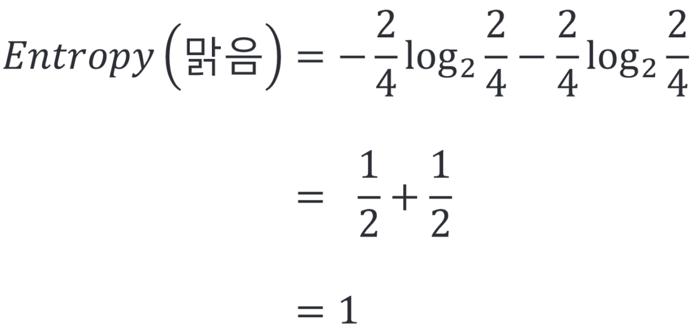
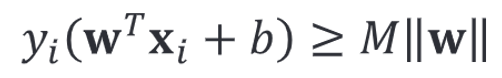

Chap 8 

# 8.1 지도학습 개요

# 8.2 사이킷런 소개

# 8.3 k-최근접 이웃 알고리즘

## 8.3.1 k-최근접 이웃 알고리즘의 개념

## 8.3.2 k-최근접 이웃 실습

# 8.4 선형 회귀 분석

## 8.4.1 선형 회귀 분석의 개념

## 8.4.2 릿지 회귀 분석 (L2 제약식)

## 8.4.3 라쏘 회귀 분석 (L1 제약식)

## 8.4.4 엘라스틱 넷

## 8.4.5 선형 회귀 분석 실습

# 8.5 로지스틱 회귀 분석

## 8.5.1 로지스틱 회귀 분석의 개념

## 8.5.2 로지스틱 회귀 분석 실습

# 8.6 나이브 베이즈

## 8.6.1 나이브 베이즈의 개념

나이브 베이즈(naïve bayes)는 서로 조건부 독립인 피처를 가정하고, 베이즈 이론을 기반으로 하는 머신러닝 알고리즘

확률 변수 Y가 주어졌을 때, 확률 변수 <!-- $X_1$ --> 과 <!-- $X_2$ --> 가 조건부 독립이면 아래 식을 만족함

관련 내용은 4.10 단원을 참고

나이브 베이즈 개념 설명을 위해 먼저 [표 8-1]과 같은 데이터 가정

[표 8-1]의 데이터는 날씨, 바람, 온도, 습도라는 4가지 피처를 이용해 타깃 변수인 배드민턴 플레이 여부 예측

나이브 베이즈 개념을 좀 더 쉽게 배우려면 우선 날씨 피처 하나만 고려

날씨에 따른 배드민턴 플레이 확률은 [표 8-2]와 같이 나타낼 수 있음

[표 8-2]는 날씨에 따른 배드민턴 플레이 확률 나타냄

날씨는 '맑음', '흐림', '비'와 같이 3가지 값을 가지고, 해당 날씨에 따른 배드민턴 플레이 확률은 조건부 확률 형태로 나타낼 수 있음

조건부 확률이므로 어떤 조건이 주어지는지에 따라 확률이 달라짐

이는 배드민턴을 플레이할 확률을 생각할 때, 날씨의 상태에 따라 확률이 바뀔 수 있다는 것을 의미

만약 날씨 조건에 상관없이 배드민턴을 플레이하는 '배드민턴=네'일 확률을 구하고 싶다면 위 식과 같이 모든 날씨 상태에 따른 조건부 확률을 모두 더하면 됨

[표 8-3]은 오리지널 데이터 셋을 바탕으로 날씨에 따른 배드민턴 플레이 여부의 빈도수 데이터를 채워 넣은 것

위 [표 8-3]의 빈도수를 기반으로 각 조건에 대한 배드민턴 플레이 확률은 [표 8-4]와 같음

지금까지는 '날씨' 피처에 대해 배드민턴 플레이 확률을 계산

동일한 방법으로 나머지 피처 '바람','온도','습도'에 대한 빈도수는 [표 8-5]와 같이 구할 수 있음

[표 8-5]를 이용하면 각 피처에 대해 배드민턴 플레이 여부의 빈도수를 확인할 수 있음

위에서 구한 빈도수를 바탕으로 확률을 구하면 [표 8-6]과 같은 결과를 얻을 수 있음

나이브 베이즈를 이용하면 조건이 주어질 떄의 배드민턴 플레이 여부를 예측할 수 있음

즉, 주어진 데이터를 이용해 배드민턴 플레이 확률 모형을 생성하고, 다음 표와 같이 새로운 데이터가 주어질 때 배드민턴 플레이 확률을 예측

위와 같은 조건에서 배드민턴 플레이 여부를 예측하는 것은 배드민턴을 플레이할 확률과 하지 않을 확률 중 더 높은 확률을 선택하는 것과 같음

즉, 아래 표처럼 주어진 피처 데이터를 조건부 확률에서의 조건이라고 가정하고, 플레이 확률을 추정하는 것.
조건이 주어질 때의 배드민턴 플레이 확률과 조건이 주어질 떄의 배드민턴을 플레이하지 않을 확률 중 높은 쪽으로 에측.
즉, 아래 표처럼 두 가지 확률을 계산하면 됨

지금부터 두 확률을 계산해보자

먼저 조건이 주어질 때 배드민터을 플레이할 확률은 아래와 같음
베이즈 정리를 이용해 식을 정리하면 최종적으로 여러가지 조건을 가정한 조건부 확률은 조건이 하나인 작고 여러개인 조건부 확률로 나눌 수 있다는 것을 볼 수 있음

즉, 위에서 구하려는 확률을 곧바로 구하기는 어렵지만 식을 변형하면 쉽게 값을 구할 수 있음

비슷한 방법으로 배드민턴을 치지 않을 확률도 구해보자

배드민턴을 치지 않을 확률도 칠 확률과 마찬가지로 작고 여러 개의 조건부 확률로 나눌 수 있음

즉, 구하려는 확률은 아래와 같이 다시 바꿔 쓸 수 있음

위 확률을 계산하면 다음과 같음

날씨 = '맑음', 바람 = '약함', 온도 = '보통', 습도 = '보통'이라는 조건이 주어질 때 배드민턴을 플레이 할 확률이 플레이하지 않을 확률보다 높으므로 최종적으로 배드민턴을 플레이하리라 예측 가능

## 8.6.2 나이브 베이즈 실습

# 8.7 의사 결정 나무

## 8.7.1 의사 결정 나무의 개념
먼저 의사 결정 나무의 개념을 설명하기 앞서 나이브 베이즈 단원에서 다루었던 동일한 데이터 셋을 사용한다고 가정

[표 8-7]은 날씨, 바람, 온도, 습도에 따라 배드민턴 플레이 여부에 대한 데이터

의사 결정 나무는 이름처럼 의사 결정을 하는 데 나무(tree)를 사용한다는 뜻

각 나무는 [그림 8-14]와 같이 생김

[그림 8-14]의 왼쪽같이 의사 결정 나무에서는 테스트를 위쪽에 놓고 해당 테스트로 발생 가능한 결과를 아래쪽에 놓음

오른쪽 그림과 같이 의사 결정 나무의 결과는 또 다른 테스트가 될 수 있음

즉, 테스트 B로 판별하지 못한 데이터는 또 다른 테스트인 테스트 C를 사용해 데이터 분류가 가능

[그림 8-15]의사 결정 나무를 일반화한 그림

용어별 뜻은 [표 8-8]을 참고

## 8.7.2 엔트로피

동일한 데이터에 대해 여러 가지 형태의 의사 결정 나무를 생성할 수 있음

의사 결정 나무는 어떤 테스트를 선택하는 지에 따라 달라짐

[표 8-7]에서 사용하는 데이터에는 날씨, 바람, 온도, 습도와 같은 네 가지 피처가 존재하므로 테스트 후보는 총 네 가지

네 가지 테스트 후보 중 첫 번째 테스트를 선정하는 기준 = 성능

그럼 개별 날씨, 바람, 온도, 습도 테스트의 성능 측정 고고

가장 먼저 날씨 테스트를 수행해보자

[그림 8-16]은 날씨 테스트 결과

날씨 테스트의 결과는 맑음, 흐림, 비로 이루어져 있으므로 각 결과에 해당하는 타깃을 결과 노드에 포함함

[그림 8-16]과 같이 날씨 테스트를 사용했을 때, 성능은 어떻게 평가?

테스트 성능 평가를 위해 엔트로피(Entropy)라는 개념 사용

엔트로피는 불순도(impurity)정도를 측정하며, 낮을수록 좋음

이 때, 불순도란 노드에 서로 다른 데이터가 얼마나 섞여 있는지를 의미

불순도가 낮을 수록 데이터가 섞여 있지 않다는 것을 위미

엔트로피는 아래와 같은 식을 따름

위 식에서 $p(i|d)는 노드 d가 주어질 때 i 클래스에 속할 확률.

위 예제는 배드민턴 플레이 여부를 분류하려는 이진 분류 문제이므로 k = 2이며, 이를 적용하면 아래와 같이 표현할 수 있음

이와 같은 엔트로피 구하는 공식을 사용하면 노드별 엔트로피를 구할 수 있음

위 공식에서 T는 노드 속 전체(total) 데이터 수, P는 Positive 데이터 수, N은 Negative 데이터 수를 의미

해당 데이터에서 Positive 데이터는 배드민턴을 플레이하는 것을 의미하고, Negative 데이터는 배드민턴을 플레이하지 않는 것을 의미

위 엔트로피 공식은 [그림 8-17]과 같은 그래프를 따름

[그림 8-17]은 노드에 포함되는 데이터 수 대비 Positive 데이터 비율에 따른 엔트로피를 그래프로 나타낸 그림입니다.

가로축이 1/2일 때 가장 높은 엔트로피 1을 보임

엔트로피는 낮을수록 성능이 높은 것을 의미하므로 가로축 1/2일 때 가장 낮은 성능을 보이고, 0 또는 1에 가까워질 수록 높은 성능을 보인다는 것을 알 수 있음

그렇다면 [그림 8-17] 노드이 데이터를 이용해 각 노드별 엔트로피를 구해보자

(1) 맑음 노드 엔트로피

(2) 흐림 노드 엔트로피

(3) 비 노드 엔트로피

각 노드별 엔트로피를 구함

각 노드별 엔트로피를 이용해 테스트 전체의 성능을 평가하려면 아래와 같은 공식 사용

엔트로피와 마찬가지로 테스트 성능 점수도 낮을수록 좋음

앞의 식에서 R_j는 전체 데이터 개수 중 해당 노드의 데이터 개수 비율을 의미함

그렇다면 실제 날씨 테스트 성능을 스코어링 해 보자

날씨 테스트에서 테스트 전체 데이터 수는 8개이고 맑음 노드는 4개, 흐림 노드는 3개, 비 노드는 1개의 데이터로 구성되어 있음

### 날씨 테스트 성능 

같은 방법으로 나머지 테스트도 진행하면 [그림 8-18]과 같음

[그림 8-18]은 각 피처를 테스트 기준으로 삼았을 때 의사 결정 나무를 그린 결과

앞서 날씨 테스트 성능을 측정했던 것처럼 바람, 온도, 습도 테스트에 대해서도 성능을 측정할 수 있음

[표 8-9]는 첫 번째 테스트 결과표

점수가 가장 낮은 테스트가 가장 좋은 성능을 나타내므로 날씨 테스트를 첫 번째 테스트로 선정

첫 번째 테스트로 날씨 테스트를 선정

하지만 [그림 8-19]와 같이 맑음 노드의 경우 배드민턴 플레이 여부를 정확히 분류하지 못하므로 해당 데이터를 분류하기 위한 추가적인 테스트가 필요

추가적인 테스트는 날씨=맑음일 경우만 고려

[표 8-10]과 같이 전체 데이터를 고려하는 것이 아닌 음영 처리한 날씨=맑음인 데이터 4개만 관심 대상이 됨

날씨가 맑음일 떄의 데이터 4개에 대해서 추가로 바람, 온도, 습도 테스트 진행

추가 테스트 후보 중 먼저 바람 테스트부터 살펴보면 [그림 8-20]과 같음

[그림 8-20]과 같이 테스트 대상 데이터가 날씨=맑음에 해당되는 데이터 4개이므로 바람 테스트 결과도 데이터 4개인 것을 볼 수 있음

바람 테스트를 사용했을 경우 배드민턴 플레이 여부를 정확히 분류할 수 있음을 알 수 있음

[그림 8-21]은 나머지 테스트 후보인 바람, 온도, 습도 테스트 결과.

이를 요약하면 다음과 같음

[표 8-11]과 같이 두 번째 테스트 성능 평가 결과, 점수가 가장 낮은 바람 테스트가 선정됨.

그러므로 첫 번째 테스트 결과와 두 번째 테스트 결과를 종합해 만든 최종 의사 결정 나무는 [그림 8-22]와 같음

## 8.7.3 지니 계수

지니 계수(Gini Index)에 대해 알아보자

지니 계수는 엔트로피와 함께 불순도를 측정하는 또 다른 방법

지니 계수는 데이터 셋에서 랜덤으로 선택한 데이터에 임의로 라벨링을 정했을 때 틀릴 확률을 의미

만약 해당 데이터 셋의 데이터가 모두 동일하게 라벨링되어 있다면 지니 계수는 최솟값 0을 갖게 되며 이는 불순도가 0임을 의미합니다.

## 8.7.4 회귀 나무

앞서 다룬 의사 결정 나무의 피처는 모두 범주형 자료

만약 의사 결정 나무의 피처가 연속형 변수라면?

이번에는 피처가 연속형 변수일 경우의 의사 결정 나무를 그려보자

아래와 같은 아주 간단한 형태의 데이터 생각

[표 8-12]에서 배드민턴 플레이 여부를 예측하기 위해 온도라는 피처가 사용되는데, 온도는 연속형 숫자를 나타내는 피처

연속형 피처를 사용할 경우, 피처값 하나하나가 테스트 후보가 됨

이를 그림으로 나타내면 [그림 8-23]과 같음

[그림 8-23]에서 24보다 작은 영역이 A라는 영역이 되며, 24와 25 사이는 B, 25와 28 사이는 C, 28 이상은 D를 나타냄

각 피처를 기준으로 나눈 영역 A,B,C,D를 참고하여 테스트를 만들면 [그림 8-24]와 같음

[그림 8-24]와 같이 연속형 피처를 이용해 테스트를 만들 경우, 각 피처 값을 따로 테스트 기준으로 정하고 테스트함

타깃 데이터가 연속형일 경우, 의사 결정 나무를 어떻게 그리는지 알아보자

의사 결정 나무에서 타깃 데이터가 연속형일 경우의 모형을 **회귀 나무(regression tree)**라고 부름

[표 8-13]과 같이 작은 데이터를 가정해 보자

피처의 경우 '바람의 세기'로 범주형 피처이며, 타깃 변수의 경우 '배드민턴 상금'으로 연속형

위 데이터를 이용해 의사 결정 나무를 만들면 [그림 8-25]와 같음

[그림 8-25]와 같은 의사 결정 나무에서 예측하는 경우, 타깃 데이터가 연속형인데 어떻게 예측할까?

연속형 타깃 데이터를 예측하는 과정을 그림으로 표현하면 [그림 8-26]과 같음

[그림 8-26]은 연속형 타깃을 대상으로 하는 의사 결정 나무를 시각화한 것

바람의 강약에 따라 예측값이 달라지는데, 예측값은 각 항목 평균값으로 예측

예를 들어, [그림 8-26]에서 바람이 '약함'일 때 출력값은 바람이 '약함'일 때의 평균값이 100으로 예측하고, 바람이 '감함'인 경우에는 그 평균값이 193으로 예측값을 예측함

의사 결정 나무는 모형을 이해하기 쉽다는 장점이 있음

다만 오버피팅된다는 단점이 있음

이러한 의사 결정 나무의 단점을 보완하기 위해 사용되는 것이 랜덤 포레스트라는 방법

랜덤 포레스트는 9단원에서 알아보자

## 8.7.5 의사 결정 나무 실습

# 8.8 서포트 벡터 머신

## 8.8.1 서포트 벡터 머신의 개념

**서포트 벡터 머신(Support Vector Machine, SVM)**은 서포트 벡터를 기준으로 클래스를 판별한다

[그림 8-28]과 같은 간단한 데이터를 예로 들어보자

각 클래스는 2개의 데이터 포인터로 구성되어 있으며 각 클래스를 구분하는 직선을 생성하는 것이 목적

[그림 8-28]의 왼쪽 그림은 데이터를 나누는 방법이 여러 가지 존재한다는 것을 보여줌

세 가지 직선 중 어떤 방법으로 나누더라도 두 개의 클래스를 잘 구분할 수 있는 것을 보여줌

클래스를 구분하는 여러 방법 중 서포트 벡터 머신은 [그림 8-28]의 오른쪽 그림처럼 중심선과 경계선을 이용해 데이터를 구분

그 경계선을 서포트 벡터라고 하며, 이것이 서포트 벡터 머신이라는 이름의 유래

그렇다면 중심선과 경계선을 어떻게 그리는지 알아보자

먼저 서포트 벡터 머신에서 중심선을 그리는 방법을 알아보자

중심선을 그리기 위해서 [그림 8-29]와 같이 중심선에 수직인 벡터 w를 구하는 것이 중요

중심선에 수직인 벡터 w와 데이터 포인트 x를 내적했을 때 내적값 c가 되는 지점이 중심선이 되고,

이는 $w^Tx = c$ 라고 표현할 수 있다

내적값 c가 되는 지점인 중심선을 기준으로 영역을 나눌 수 있다

[그림 8-29]와 같이 데이터 공간을 내적값이 c보다 큰 영역과 c보다 작은 영역으로 각각 나누면 중심선 윗부분과 아랫부분으로 나눌 수 있다는 것을 알 수 있다

\
다음 단계로 진행하기에 앞서 계산의 편의성을 위해 중심선 $w^Tx = c$에서 우변을 0으로 변환시킨다

c를 좌변으로 이항시키면 $w^Tx - c = 0$ 이 되고 -c를 b로 치환하면 중심선을 $w^Tx + b = 0$이라고 표현할수 있다

[그림 8-29]에서는 2차원 피처 데이터를 다루었는데 이를 p 차원으로 일반화시킨다

데이터 $(x_1,y_1),(x_2,y_2),...,(x_n,y_n)$가 존재할 때, $x_i = (x_1,x_2,...,x_p) \in R^p$ 이며, 타깃 데이터는 -1 또는 1에 속하며 $y_i \in {-1,1}$라고 씀

이 때, 아래와 같은 초평면(hyperplane)을 가정

아래 수식이 데이터 클래스를 구분하는 초평면

이 때, 가중치는 $w_i = (w_1, w_2,...,w_p) \in R^p$이다

이를 이용해 중심선과 경계선을 다시 나타내면 [그림 8-30]과 같다

[그림 8-30]에서는 중심선과 경계선의 거리를 편의상 1로 설정

이 때, 각 영역을 나타내는 식을 간단히 나타내면 다음과 같다

다음 식에서 sign은 부호를 의미

각 영역을 나타내는 식을 위 식보다 좀 더 간단히 표현할 수는 없을까?

이를 위해 타깃 $y_i \in {-1,1}$을 이용함

기존의 각 영역을 나타내는 $w^Tx_i + b >= 1$과 $w^Tx_i + b <= -1$에 y_i를 곱하면 분류식을 아래와 같이 통일할 수 있다

경계선에 걸쳐 있는 $y_i(w^Tx_i + b) - 1 = 0$을 만족한다

서포트 벡터 머신에서는 마진(margin)을 최대화하는 것이 목표

여기서 마진이란 서포트 벡터 간 너비(width)를 의미

그렇다면 마진은 어떻게 구할 수 있을까?

[그림 8-31]과 같이 중심선에 수직인 벡터 w와 서포트 벡터에 걸쳐 있는 데이터 x_1과 x_2를 이용하면 마진을 구할 수 있음

서포트 벡터 간 마진을 구하는 공식은 아래와 같음

즉, 위 식처럼 각 영역에 걸쳐 있는 벡터의 차에 중심선과 수직인 벡터를 내적하면 마진을 구할 수 있음

좀 더 자세히 나타내면 다음과 같음

마진이 2 / ||w||라는 말은 서포트 벡터 머신의 마진이 w에 의해 결정된다는 의미

위 식에서 x_2^Tw = 1 - b, -x_1^Tw = 1 + b 임을 활용함

이는 아래와 같은 과정을 통해 확인할 수 있다

(1) y_i = 1인 경우

(2) y_i = -1인 경우

이 두 결과를 이용하면 마진을 구할 수 있으며, [그림 8-32]와 같이 표현 가능

서포트 벡터 머신의 목적은 마진을 최대화하는 것이므로 앞서 구한 마진을 최대화해보자

지금부터 마진을 2M이라고 함

제약 조건에서 마진을 최대화하는 것을 수식으로 표현하면 다음과 같음

즉, 마진을 최대화하는 것이 목적이므로 목적 함수는 M을 최대화하는 것이라고 표현할 수 있고, 주어진 데이터가 마진 외부에 존재해야 하므로 y_i(w^Tx_i + b) >= M 라는 제약 조건을 설정함

벡터 w의 크기가 1이라는 제약식 ||w|| = 1도 설정

위 식에서 ||w|| = 1이라는 조건과 y_i(w^Tx_i + b) >= M 라는 조건을 합칠 수 있음

즉, 제약식 y_i(w^Tx_i + b) >= M 에서 쓰이는 벡터 w의 크기를 1로 만든다면 제약식 ||w|| = 1과 y_i(w^Tx_i + b) >= M 을 합칠 수 있다

위와 같이 쓰면 기존의 제약식 y_i(w^Tx_i + b) >= M의 w의 크기가 1로 변경됨으로써 ||w|| = 1을 만족하므로, 더이상 제약식 ||w|| = 1을 사용하지 않아도 됨

위 식에서 양변에 ||w||를 곱하면 아래와 같음

위 식에서 M = 1 / ||w||이라는 사실을 이용하면 제약식을 아래와 같이 변형 가능

위에서 정리한 제약식을 적용하면 서포트 벡터 머신의 최적화 식을 아래와 같이 표현할 수 있음

위 식에서 1 / ||w||을 최대화하는 것은 분모를 최소화하는 말과 동일하므로 아래 식으로 표현할 수 있음

수학적으로 계산의 편리함을 위해 ||w||를 ||w||^2/2로 바꾸면 아래와 같이 쓸 수 있음

목적 함수와 제약식을 라그랑주 프리멀 함수 형태로 아래와 같이 쓸 수 있음

이 식의 최적값을 구하기 위해 w, b에 대해 미분을 함

위 식에서 ?????인 이유는, ||w|| = w^Tw 임을 이용하면 됨

위에서 구한 편미분 결괏값을 라그랑주 프리멀 함수에 대입하면 아래와 같이 라그랑주 듀얼 함수를 구할 수 있음

라그랑주 듀얼 함수는 아래와 같음

라그랑주 프리멀 함수와 듀얼 함수를 모두 만족하는 최적값임을 보이기 위해서는 KKT 조건(Karush-Kuhn-Yucjer condition)을 만족하므로 아래 식이 성립해야 함

위 식이 0인 이유를 알아보자

앞서 라그랑주 듀얼 함수에서 \alpha_i >= 0임을 알 수 있다

만약 \alpha_i > 0이라면 x_i가 서포트 벡터에 걸쳐 존재한다는 의미이므로 y_i(w^Tx_i + b) = 1 이 되어 위 식은 0을 만족

만약 y_i(w^Tx_i + b) > 1 이라면 x_i가 경계선에 존재하지 않으므로 제약조건이 발동되지 않아 \alpha_i = 0 이 성립

위와 같이 KKT 조건을 만족하므로 앞서 구한 라그랑주 프리멀 함수의 편미분 값이 최적화 값임을 알 수 있음

## 8.8.2 소프트 마진

앞서 다룬 서포트 벡터 머신은 데이터가 잘못 분류되는 경우는 고려하지 않음
즉, 트레이닝 데이터로 서포트 벡터 머신을수행했을 때 서포트 벡터를 기준으로 올바르게 분류되지 않은 영역에 데이터 포인트가 존재하는 경우는 없다는 뜻

## 8.8.3 커널 서포트 벡터 머신

## 8.8.4 서포트 벡터 회귀

## 8.8.5 서포트 벡터 머신 실습

# 8.9 크로스 밸리데이션 실습
