앙상블 학습

# 9.1 앙상블 학습 개념

앞서 배운 지도 학습은 피처 데이터와 타깃 데이터를 이용해 전체 데이터를 분류하는 학습 방법

지도 학습에 사용되는 데이터는 각 피처 데이터마다 타깃 변수가 올바르게 할당된 라벨링 데이터였고 이를 기반으로 학습 알고리즘을 생성하는 과정을 거침

**앙상블 학습(ensemble learning)**은 핵심 아이디어는 트레이닝 데이터를 기반으로 분류 모형을 여러 개 만들고 서로 비교하는 것

앙상블 학습 과정에서 만든 개별 분류 모형을 분류기(classifier)라고 함

여러 개의 분류기를 결합합으로써 개별적인 분류기보다 성능이 뛰어난 최종 분류기를 만드는 것이 앙상블 학습의 목적

이는 실생활에서 우리가 중요한 결정을 앞두고 여러 가지 의견을 모으고 종합해 최종 결정을 하는 것과 유사

# 9.2 보팅

## 9.2.1 보팅의 개념

앙상블 학습에는 여러 가지 방법이 존재하는데, 이번 단원은 **보팅(voting)**에 대해 설명

이 방법은 여러 개의 분류 모형의 결과를 대상으로 투표를 통해 최종 클래스 라벨을 정하는 방법, [그림 9-1] 참고.

예를 들어 분류기가 10개가 있다고 했을 때, 특정 데이터에 대해 7개의 분류기는 클래스 1이라고 예측하고, 나머지 3개의 분류 모형은 클래스 2라고 예측했다고 해 보자

그렇다면 클래스 1이 가장 놓은 득표수를 보이므로 최종적으로 클래스 1로 예측

이를 다수결 투표(plurality voting)라고 하는데 이와 비슷한 방법으로 다수결이 아닌 절반 이상의 분류기의 표를 얻어야 하는 과반수 투표(majority voting) 방식이 있음

개별 분류기는 여러 가지 알고리즘을 사용해서 만들 수 있다

앞서 배웠던 지도 학습 방법 중 로지스틱 회귀, 서포트 벡터 머신, 결정 트리 등을 사용해서 다양한 분류 모형을 만들 수 있다.

	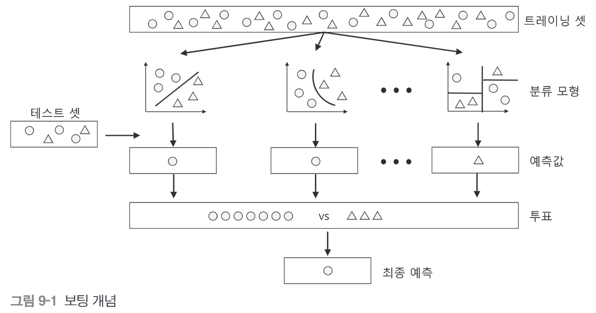

앙상블 학습 모형은 개별 모형보다 성능이 뛰어난데 왜 그럴까?

두 가지 클래스를 분류하는 이진 분류 문제를 푼다고 했을 때, 동일한 에러율 ε를 가진 n개의 분류기를 가정해보자

모든 분류기의 오차는 서로 독립적이라서 서로 상관관계가 없다고 가정한다.

이런 가정 아래 n개의 분류기로 구성된 앙상블 모형의 오차 확률은 이항 분포를 따른다

즉, n갸의 분류기 중 k개  이상의 분류기의 예측이 틀렸다고 하면 다음과 같이 표현할 수 있다.

	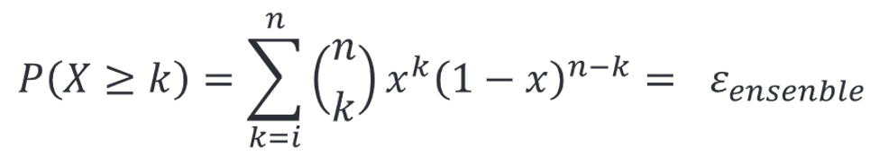

위 식에서 왜 X는 k보다 크거나 같을까?

그 이유는 앙상블 분류기가 틀리려면 과반수의 개별 분류기가 틀려야 함

예를 들어, 9개의 분류기로 구성된 앙상블 분류기가 있다고 해보자

이 분류기가 틀리려면 과반수의 개별 분류기가 틀려야 함

즉, 최소 5개의 분류기의 예측이 틀려야 함

각 분류기의 에러율이 0.3이라고 하면 이를 식으로 나타내면 다음과 같음

	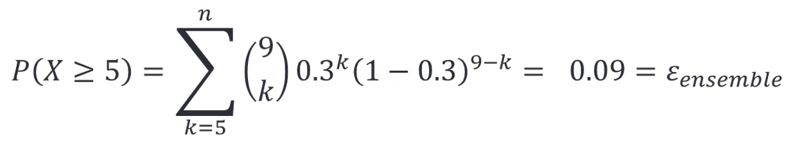

9개의 분류기를 통해 앙상블 분류기를 만들었더니 개별 분류기의 에러율 0.3보다 작은 0.09가 되었다.

이처럼 개별 분류기보다 앙상블 분류기가 더 나은 성능을 보인다는 것을 알 수 있다

## 9.2.2 보팅 실습

# 9.3 배깅과 랜덤 포레스트

## 9.3.1 독립적 앙상블 방법

앙상블 학습은 크게 독립적 앙상블 방법과 의존적 앙상블 방법으로 나눌 수 있음

이번 단원에서 다룰 방법은 독립적 앙상블 방법

독립적 앙상블 방법에서 사용하는 개별 분류기들은 서로 독립적인 알고리즘이므로 각 분류기는 서로 다른 머신러닝 알고리즘을 사용할 수도 있음

각 분류기가 독립적이므로 효과적으로 병렬화할 수 있다는 장점이 있음

이번 단원에서는 독립적 앙상블 방법 중 배깅과 랜덤 포레스트에 대해 알아보자

## 9.3.2 배깅과 랜덤 포레스트의 개념

**배깅(bootstrap aggregating)**은 개별 분류기들의 분류 결과를 종합하여 최종 분류기의 성능을 향상하는 방법

앞서 개별 분류기들이 동일한 트레이닝 데이터로 학습하는 보팅과 달리 배깅은 오리지널 트레이닝 데이터 셋에서 부트스트랩 샘플을 뽑아 학습

부트스트랩이란 중복을 허용한 랜덤 샘플 방법을 의미

개별 분류 모형의 결괏값을 모아 다수결 투표를 통해 최종 예측하게 됨

	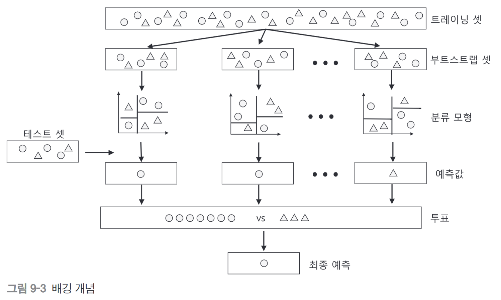

[그림 9-3]은 배깅 개념을 나타낸 그림

주로 배깅에 사용하는 개별 분류기들은 모두 같은 머신러인 알고리즘

배깅을 이용한 가장 유명한 알고리즘에는 랜덤 포레스트가 있다

랜덤 포레스트(random forest)는 여러 개의 개별 분류기인 의사 결정 나무를 토대로 예측한 결과를 종합해 전체 예측 정확도를 높이는 방법

	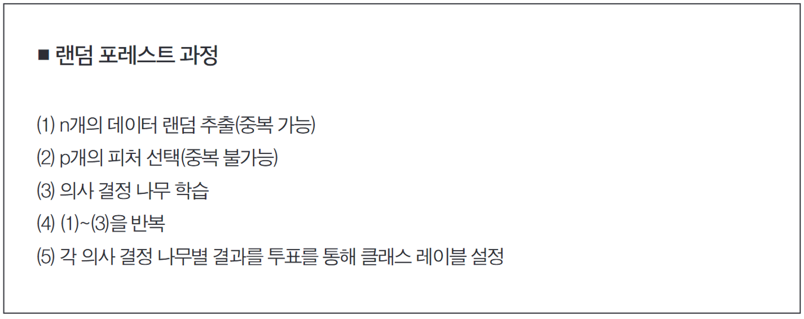

## 9.3.3 랜덤 포레스트 실습

## 9.3.4 배깅 실습

# 9.4 부스팅

## 9.4.1 의존적 앙상블 방법

**의존적 앙상블 방법(Dependent Ensemble Method)은 독립적 앙상블 방법과는 달리 개별 학습기들이 서로 독립이 아닌 경우 의미

의존적 앙상블 방법 중 가장 유명한 것은 부스팅(Boosting)

부스팅의 핵심 아이디어는 분류하기 어려운 데이터에 집중한다는 것

이는 트레이닝 데이터에 포함되는 모든 데이터 포인트에 가중치를 할당함으로써 관심의 정도를 반영할 수 있음

초기에는 모든 데이터 포인트에 대해 동일한 가중치를 할당함

점차 학습이 진행되면서 올바르게 분류된 데이터 포인트의 가중치는 감소하는 반면에 잘못 분류된 데이터 포인트의 가중치는 증가함

결과적으로 학습이 진행되면서 학습기는 분류하기 어려운 데이터에 집중하게 됨

즉, 이전 단계에서 만들어진 학습기는 다음 단계에서 사용할 트레이닝 셋의 가중치를 변경하는 데 사용

부스팅은 배깅과는 달리 이전 분류기의 성능에 영향을 받음

특히 새로운 분류기는 이전 분류기의 성능에 따라 잘못 분류된 데이터에 더 집중

배깅에서는 각 데이터 포인트가 추출될 확률이 모두 동일했지만, 부스팅에서는 각 데이터 포인트에 할당된 가중치에 비례해 추출됨

## 9.4.2 에이다 부스트 개념 설명

부스팅은 약한 학습기 여러 개를 모아 하나의 강한 학습기를 만드는 반법

약한 학습기는 깊이가 1인 의사 결정 나무와 같은 아주 간단한 모형을 말하며 50% 정도의 낮은 정확도를 보임

개별적으로는 이렇게 약한 학습 모형이지만, 이와 같은 모형을 다수 생성하고 부스팅을 적용함으로써 강한 학습기가 만들어짐

\
앞서 보팅이나 배깅은 [그림 9-6]의 위 그림처럼 모형이 병렬적으로 수행될 수 있었음

예를 들어, 10개의 모형이 있다고 하면 10개의 모형을 동시에 학습시킬 수 있다는 뜻

이애 반해 부스팅은 [그림 9-6]의 아래 그림처럼 여러 약한 학습기가 순차적으로 적용

그 이유는, 약한 학습 모형의 학습 이후 판별하지 못한 데이터 포인트에 대해서 가중치를 부여하기 때문

	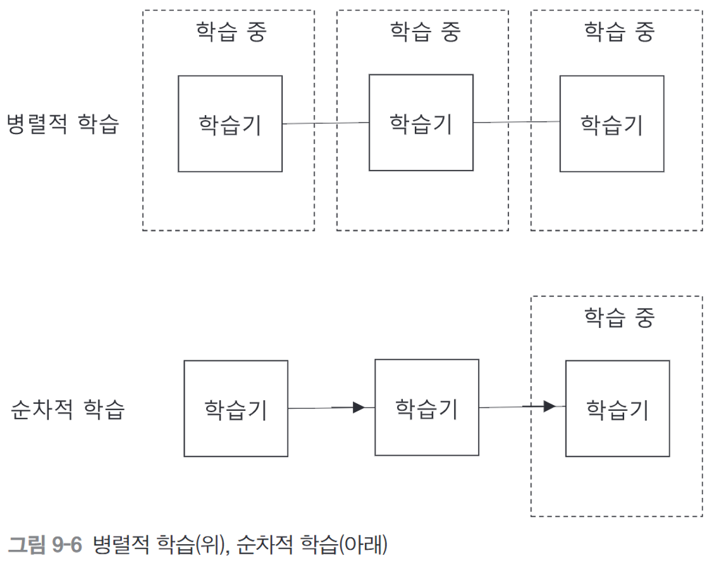

**에이다 부스트(adaboost)**의 핵심 아이디어는 분류하기 어려운 트레이닝 데이터에 가중치를 더 높이는 것.

즉, 이전에 잘못 분류된 트레이닝 데이터 포인트는 가중치가 증가해 오차율이 높아짐

다음 약한 학습기는 이전에 증가한 오차율을 낮추는 방향으로 학습하게 됨

	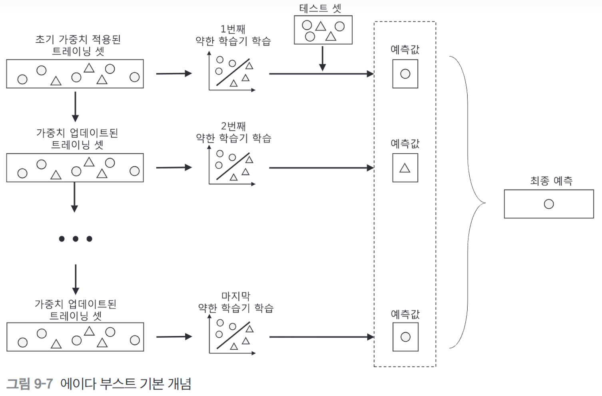

예를 들어, 이진 분류 문제를 가정해 보자

데이터는 모두 n개의 데이터로 구성되어 있으며, 타깃 Y는 -1 또는 1 값을 가짐

즉, Y \in {-1, 1} 

피처를 X라고 하고, 분류기가 총 m개 존재한다고 했을 때, j번째 약한 분류기를 f_j(X), 강한 분류기를 F(X)라고 함

이 때, 트레이닝 셋의 오차율 e는 다음과 같음

	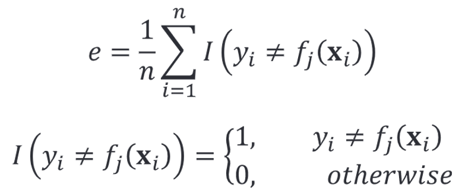

위 수식에서 I는 지시 함수(indicator function)를 의미하는데 괄호 속 조건을 만족하면 1, 만족하지 않으면 0이다.

즉, 오차율은 실제 y_i 값과 약한 학습기의 분류 결과가 일치하지 않는 데이터 포인트 개수를 의미

	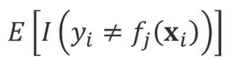

앞의 식과 같이 오차율운 곧 오차의 기댓값이라고 말할 수 있음

앞선 정보를 바탕으로 약한 학습기의 학습 이후, 트레이닝 데이터의 각 데이터 포인트 (x_i, y_i)별로 가중치 w_i가 적용됨

처음 적용하는 약한 학습기의 경우, 업데이트할 가중치가 없으므로 모든 데이터 포인트가 1/n로 동일한 가중치가 적용

약한 학습기들의 학습 이후 강한 학습기의 최종 예측은 아래와 같음

	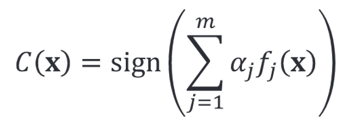

즉, 강한 학습기의 최종 예측은 개별 약한 학습기의 예측값에 가중치 \alpha_j를 적용한 후 모두 합한 걊의 부호(sign)를 의미

여기서 '부호'가 들어가는 이유는 이진 분류에서 +1로 판별된 경우가 많다면 부호가 +일 것이고, -1로 분류된 경우가 많다면 -일 것이기 때문

이때, 약한 학습기별로 적용되는 가중치 \alpha_j는 위에서 구한 데이터 포인트 개별 가중치 w_i를 통해 구할 수 있음

	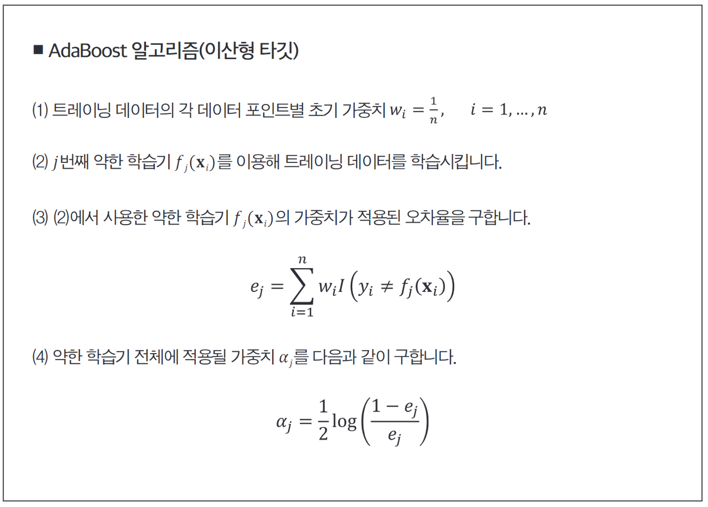

	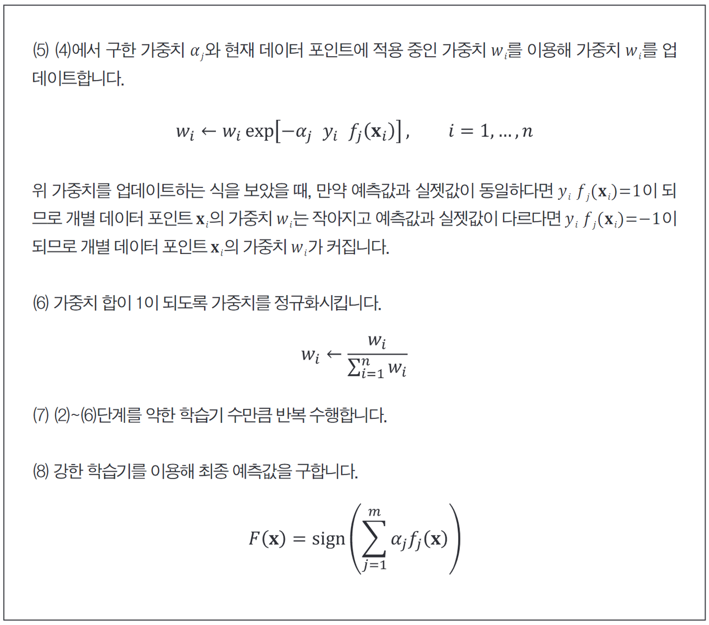

위 과정에서 마지막 순서의 의미는 에이다 부스트에서도 각각의 약한 분류기의 결과를 모아 투표를 실시하지만, 투표할 때 약한 분류기별로 투표 결과에 가중치를 부여한다는 뜻

에이다 부스트는 일반적인 부스팅과는 다르게 약한 학습기를 훈련할 때 훈련 데이터 셋 전체를 사용

훈련 샘플은 반복할 때마다 가중치가 다시 부여되며 이 앙상블은 이전 학습기의 실수한 부분을 학습하는 가장 강력한 분류기를 만듬

	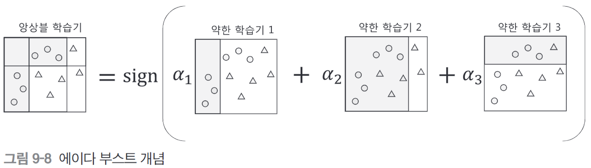

지금까지는 분류의 타깃값을 -1 또는 1로 나타냄

즉, 이산형 타깃 데이터값을 가지는 경우를 다룸

이번에는 분류 되는 타깃값이 이산형 값이 아닌 연속형 실숫값을 가지는 경우를 살펴보자

실숫값 타깃 데이터갑은 해당 클래스에 속할 확률로 나타냄

	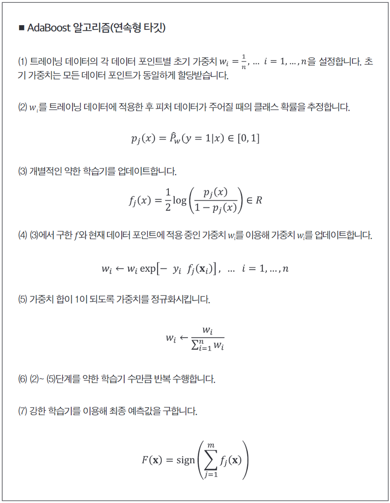

## 9.4.3 에이다 부스트 실습

## 9.4.4 그래디언트 부스팅 개념 설명

그래디언트 부스팅은 앞서 다른 에이다 부스트와 마찬가지로 부스팅의 한 종류

**그래디언트 부스팅(gradient boosting)**은 그래디언트(gradient)를 이용해 부스팅하는 방법

즉, 그래디언트 부스팅은 비용 함수를 최적화시킴으로써 학습 능력을 향상하는 알고리즘

[그림 9-10]은 간단한 트리 모형을 기반으로 하는 그래디언트 부스팅의 개념을 나타냄

그림은 원(circle)과 삼각형을 분해하는 모형을 만드는 과정

최상단 그림부터 보면 x = 1에 수직선을 생성함에 따라 원과 삼각형을 분해하려고 했음

즉, 첫 번째 모형은 x < 1 이면 원이라고 판단하고, 그렇지 않다면 삼각형으로 판단

첫 번째 모형의 결과를 보면 원 3개가 섞여 있는 것을 볼 수 있는데, 이 3개의 원이 첫 번째 모형의 손실에 해당하고 두 번째 모형을 만들 때 가중치를 받게 됩니다.

두 번째 모형을 y = 3이라는 간단한 트리 모형과 첫 번째 모형의 합이라고 함

두 번째 모형의 결과는 오직 삼각형 1개만이 오분류된 것을 볼 수 있음

마지막으로 x = 4라는 모형을 추가해 세 번째 모형을 만듦으로써 원과 삼각형을 분류할 수 있었음

세 번째 모형을 수행할 때는 앞서 가중치가 높아졌던 원 3개의 가중치를 낮추고 두 번째 모형에서 오분류된 삼각형의 가중치를 증가시킴

	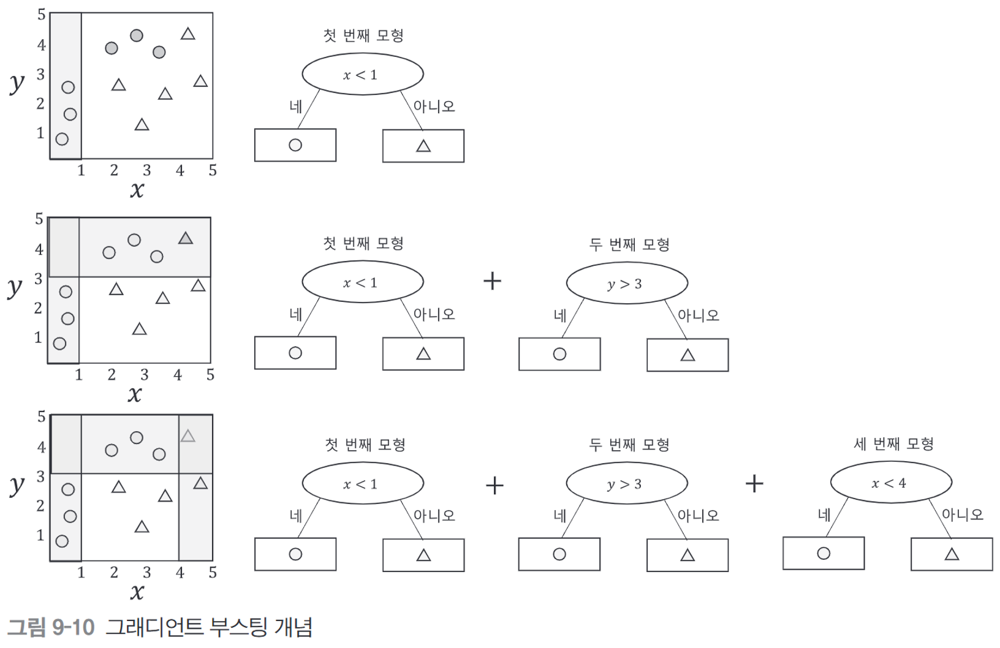

그래디언트 부스팅은 그래디언트 개념을 이용하는 부스팅임

그렇다면 위와 같은 과정이 그래디언트와 무슨 관련이 있을까?

[그림 9-11]은 일반적인 학습 과정을 나타냄

	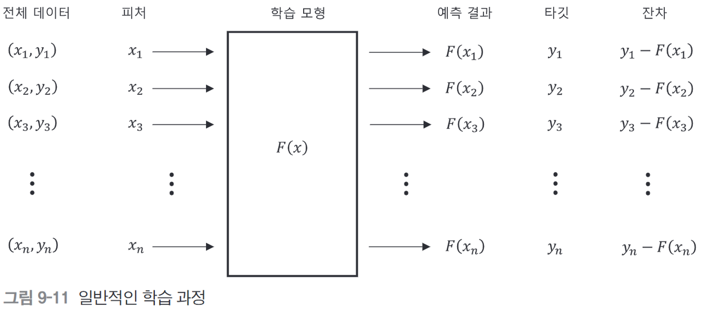

피쳐 x를 학습 모형 F에 넣으면 예측 결과 F(x)를 구할 수 있음

그리고 실제 타겟 데이터 y와 예측 결과 F(x)를 비교한 후 그 차이인 잔차 y - F(x) 또한 구할 수 있음

잔차가 작을수록 모형의 성능이 좋으며, 잔차가 클수록 모형의 성능이 좋지 않은 것을 의미함

	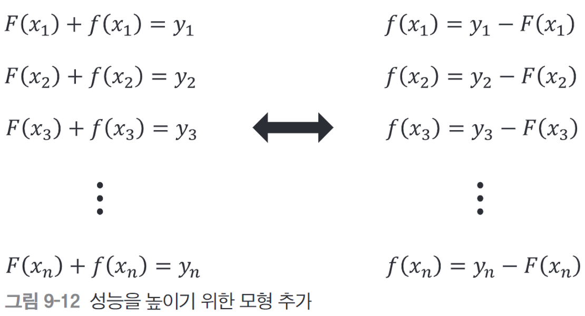

기존의 모형 F의 성능을 높이기 위해서는 어떻게 할 수 있을까요?

이를 위해 예측값인 F(x)와 타깃 데이터 y의 차이를 좁힐 수 있는 새로운 모형 f를 추가

새로운 모형 f는 [그림 9-12]처럼 타깃 데이터 y와 기존 예측값인 F(x)를 이용해 구할 수 있음

	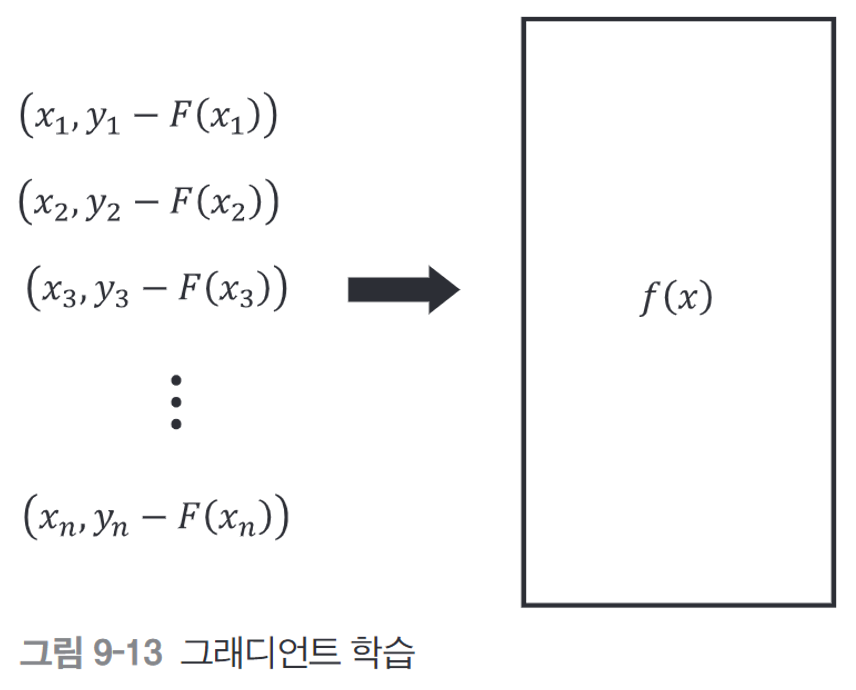

새로운 모형 f는 기존의 데이터 쌍 (x,y)로 학습하는 것이 아닌 [그림 9-13]과 같이 피쳐 데이터와 기존 모형의 잔차 데이터 쌍 (x, y - F(x))를 이용해 f를 학습

한편, 손실함수 L과 목적함수 J를 아래와 같이 정의

	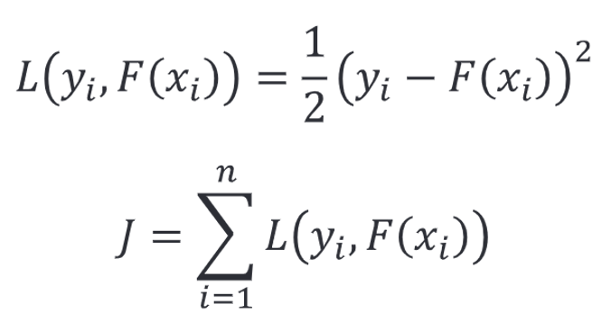

위 손실 함수와 목적 함수를 이용해 기존 모형의 그래디언트를 아래와 같이 구할 수 있음

	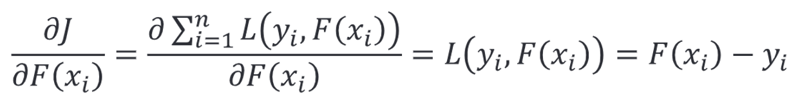

지금까지 다룬 내용을 요약해서 m번째 모형 F_m(x)를 구하는 방법은 아래와 같음

	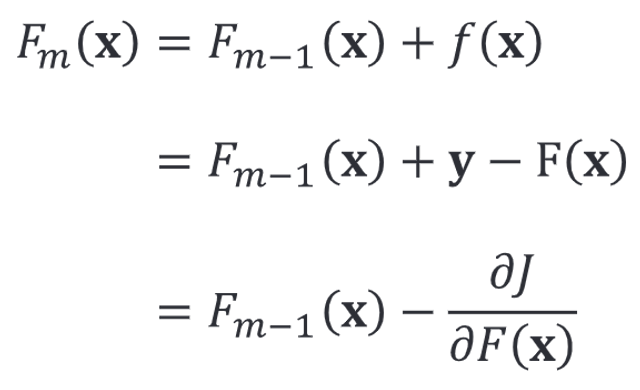

위 식을 보면 그래디언트의 개념과 관련이 있다는 것을 알 수 있음

다음은 회귀 나무를 약한 학습기로 설정한 그래디언트 부스팅 트리 모형(gradient tree boosting algorithm)의 알고리즘

	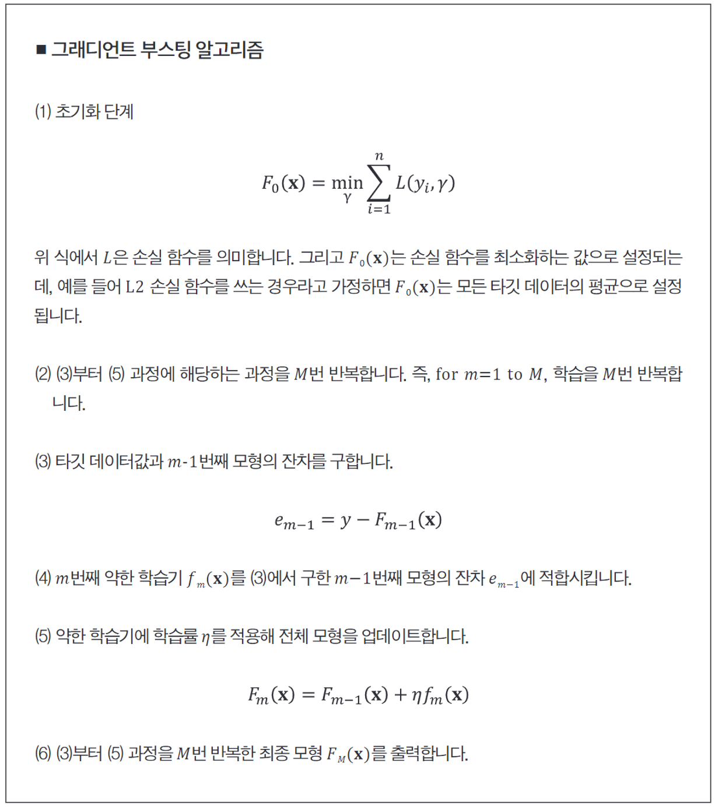

사이킷런 라이브러리를 통해 그래디언트 부스팅 회귀 모형(GradientBoostingRegressor)를 실행할 때 subsample이라는 옵션을 사용하면 각 트리가 학습할 때 사용하는 트레이닝 데이터의 비율을 정할 수 있음

예를 들어, subsample = 0.2 라고 하면 각 트리는 트레이닝 데이터의 20% 비율로 데이터를 랜덤으로 선택함

이러한 방법을 확률적 그래디언트 부스팅(stochastic gradient boosting)이라고 함

파이썬을 기반으로 하는 그래디언트 부스팅과 관련된 라이브러리가 다수 존재

기본적으로 사이킷런에서 제공하는 라이브러리를 이용할 수도 있고, XGBoost라는 라이브러리를 사용할 수도 있음

또한 XGBoost가 다소 무겁다는 단점을 보완한 LightGBM이라는 라이브러리도 사용됨

## 9.4.5 그래디언트 부스팅 실습

# 9.5 스태킹

## 9.5.1 스태킹의 개념

**스태킹(stacking)**은 우리말로 '쌓는다'리는 뜻

이처럼 스태킹은 여러 가지 학습기를 쌓는 방법

스태킹은 베이스 학습기(base learner)와 메타 학습기(meta learner)로 구성되어 있음

베이스 학습기와 메타 학습기는 이전에 배운 서포트 벡터 머신, 랜덤 포레스트와 같은 학습 모형

베이스 학습기가 먼저 학습한 후 메타 학습기는 베이스 학습기의 예측을 피처 데이터로 활용해 최종 예측을 함

스태킹은 다음과 같은 과정을 거침

	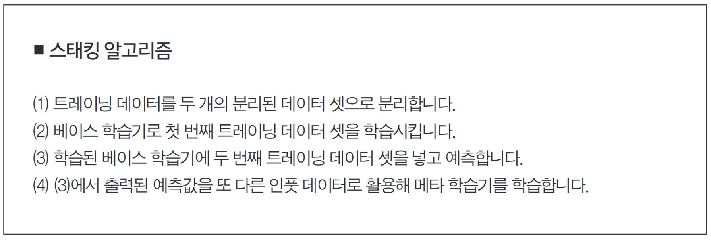

위와 같은 스태킹 알고리즘을 그림으로 나타내면 [그림 9-15]와 같음

	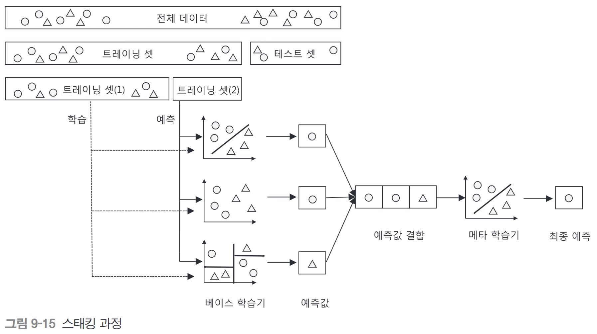

## 9.5.2 스태킹 실습

